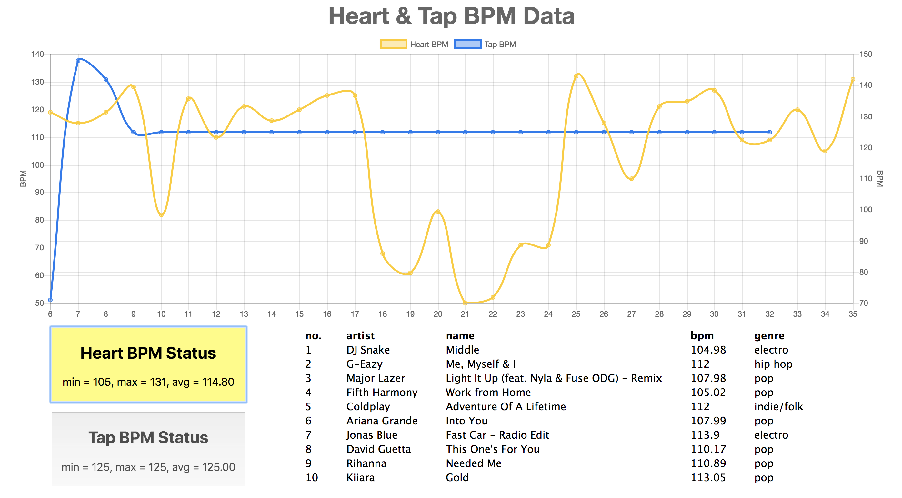

## Description

"Heart 2 Music" is a system that can play proper and comfortable music according to the heart rate and the emotion of a person. It will first gather user data by sensors and send it to cloud for analyzing user current status. Cloud will then send back the most proper music lists and play them on user speaker (future work). Basically, there are two kinds of data we would like to gather from user:

1. heart rate: we will map it to a corresponding BPM (Beat per Minute) value.

2. physical pressure: we will map it to how "intensity" the user feel/want right now.

The first one fairly makes sense. The second one can be little tricky because user can consciously decide the input level. However, we think this is a part of user current emotion and we also believe this kind of interaction will make our system more interesting.

## Required Components

- Ardinuo UNO * 1 
- LED * 2 Square Force Detection * 1 
- SparkFun Wifi Module ESP8266 * 1 
- SparkFun Particle Sensor Breakout * 1

## Snippet

While developing, use:

`npx babel --watch src --out-dir public/javascripts --presets react-app/prod`

